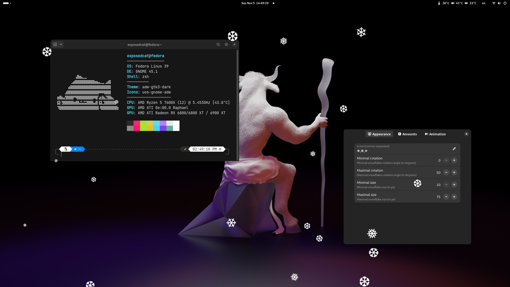

<h1 align="center">
  SNOWY 
  
</h1>

<strong>Make you festive mood with falling snow on your GNOME DE system</strong>

 
<h1>Installation</h1>
<h2>GNOME Extensions website (recommended)</h2>

<h2>Build from source</h2>
1. Download and build extension
<pre language="bash">
<code>git clone https://github.com/ExposedCat/snowy.git
glib-compile-schemas snowy/schemas
</code></pre>
2. Add extension to system
<pre language="bash">
<code>mv snowy ~/.local/share/gnome-shell/extensions/snowy@exposedcat
</code></pre>
3. Restart shell
<ul>
  <li>On X11: restart shell</li>
  <ol>
    <li>Press <code>Alt</code>+<code>F2</code></li>
    <li>Type <code>r</code></li>
    <li>Press <code>Return</code></li>
  </ol>
  <li>On Wayland: logout and login again</li>
</ul>
<h1>Configuration</h1>
GUI settings are still in development (<b>contribution is highly appreciated</b>), but you can tweak nearly everything using <code>gsettings</code> command: 
<pre language="bash">
  gsettings --schemadir \
  ~/.local/share/gnome-shell/extensions/snowy@exposedcat/schemas \
  set org.gnome.shell.extensions.snowy \
  GSKEY VALUE
</pre>
To see list of current settings values use following command: 
<pre language="bash">
  gsettings --schemadir \
  ~/.local/share/gnome-shell/extensions/snowy@exposedcat/schemas \
  list-recursively org.gnome.shell.extensions.snowy
</pre>
Here <code>GSKEY</code> is <b>GSettings Key</b> of setting and <code>VALUE</code> is setting value. 
All available tweaks listed here:
 
 
<table>
  <thead>
    <tr>
      <th>
        <em> Description </em>
      </th>
      <th>
        <em> GSettings Key </em>
      </th>
      <th>
        <em> Default value </em>
      </th>
    </tr>
  </thead>
  <tbody>
    <tr>
      <td>
        
 Snowflake icons list 

      </td>
      <td>
        <code> flake-icons </code>
      </td>
      <td>
        <code> ❅,❆,❄ </code>
      </td>
    </tr>
    <tr>
      <td>
        
 Minimal size of snowflake 

      </td>
      <td>
        <code> min-size </code>
      </td>
      <td>
        <code> 20 </code>
      </td>
    </tr>
    <tr>
      <td>
        
 Minimal size of snowflake 

      </td>
      <td>
        <code> max-size </code>
      </td>
      <td>
        <code> 30 </code>
      </td>
    </tr>
    <tr>
      <td>
        
 Snow falling interval in ms (less = higher drop rate) 

      </td>
      <td>
        <code> interval </code>
      </td>
      <td>
        <code> 2000 </code>
      </td>
    </tr>
    <tr>
      <td>
        
 Minimal snowflakes number per one fall 

      </td>
      <td>
        <code> min-flakes </code>
      </td>
      <td>
        <code> 1 </code>
      </td>
    </tr>
    <tr>
      <td>
        
 Maximal snowflakes number per one fall 

      </td>
      <td>
        <code> max-flakes </code>
      </td>
      <td>
        <code> 5 </code>
      </td>
    </tr>
    <tr>
      <td>
        
 Maximal snowflakes number on the screen (max-flakes restriction). Re-enable extension to apply 

      </td>
      <td>
        <code> flakes-limit </code>
      </td>
      <td>
        <code> 30 </code>
      </td>
    </tr>
  </tbody>
</table>
 

## License
Snowy Gnome Shell extension is distributed under the terms of the GNU General Public License,
version 2 or later.
